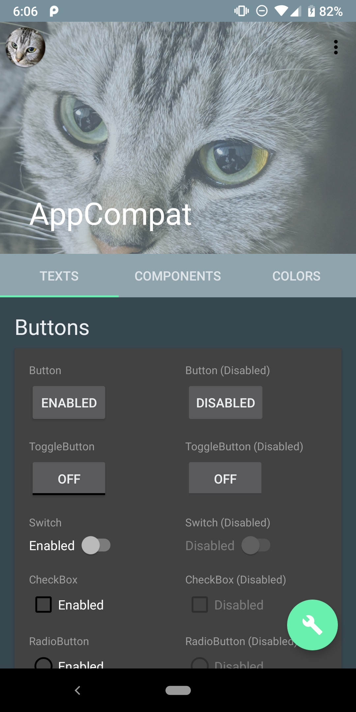
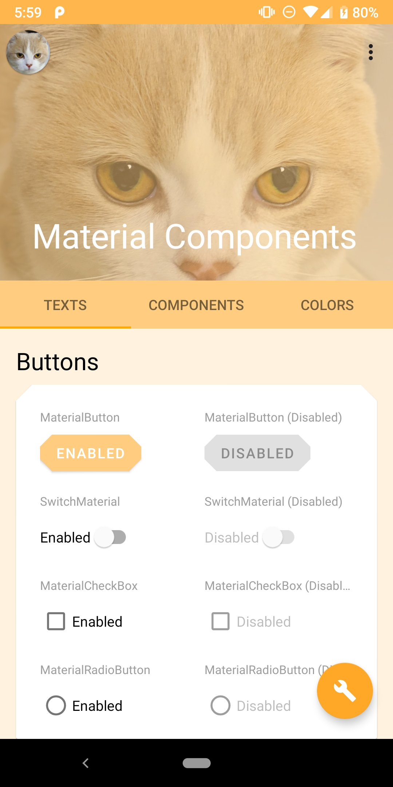

#  Master of Android Theme

[](https://circleci.com/gh/konifar/master-of-android-theme)

This app is the example app for [DroidKaigi 2019 session](https://droidkaigi.jp/2019/timetable/70938)

# Features
  

- The show cases which are applied AppCompat and MaterialComponents theme.
- Each page supports DayNight mode.

# License
```
Copyright 2019 Yusuke Konishi

Licensed under the Apache License, Version 2.0 (the "License");
you may not use this file except in compliance with the License.
You may obtain a copy of the License at

   http://www.apache.org/licenses/LICENSE-2.0

Unless required by applicable law or agreed to in writing, software
distributed under the License is distributed on an "AS IS" BASIS,
WITHOUT WARRANTIES OR CONDITIONS OF ANY KIND, either express or implied.
See the License for the specific language governing permissions and
limitations under the License.
```
